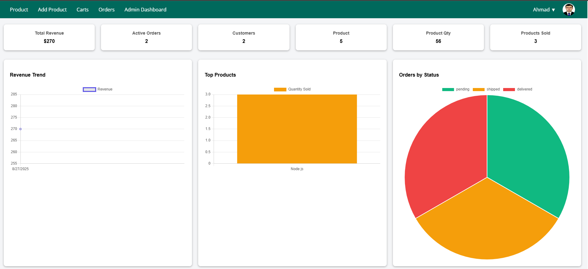
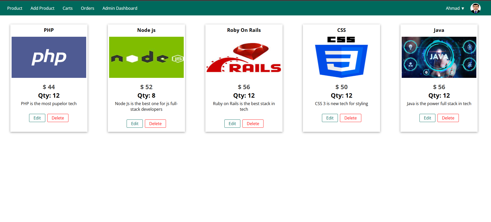
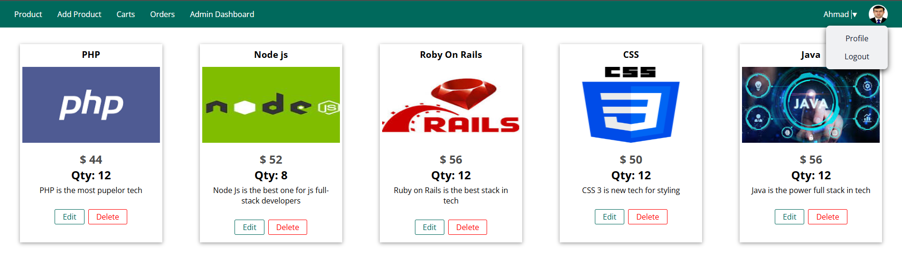
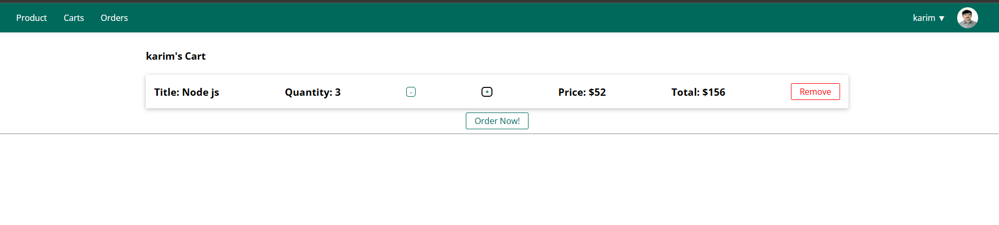
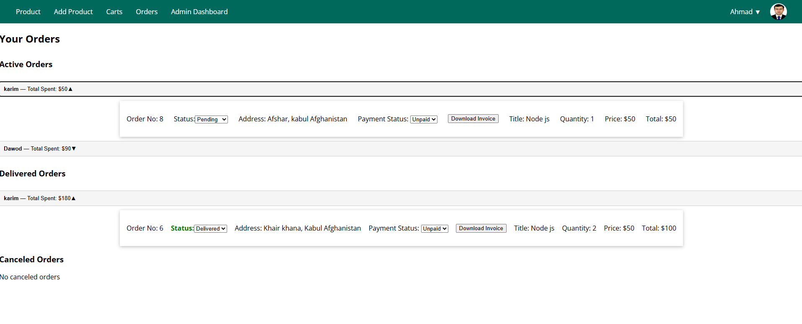

# Online BookStore

This is a Node.js project for managing a online bookstore.

## Features

## Admin manage bookStore

- Admin Dashboard( Show revenue, sales stats, orders by status, Product status, Add new products, update product)
- Client ( access all products,Cart System on product cards. generate cart, increase/decrease qty
  and remove product item from cart, create Orders, check the Order status.)
- User authentication
- Responsive UI

> It is built using React.js as frontend , Express and postgresql

## Built With

- React (rsbuild)
- Redux (redux-query)
- CSS3
- Express
- Sequelize
- PostgreSQL

## sneak peek








## Getting Started

**Prerequisites:** A Web Browser (preferably FireFox or Chrome)
To get a local copy up and running follow these simple example steps.

## Installation

```bash
- Express:
npm init -y
npm install express
npm start
```
